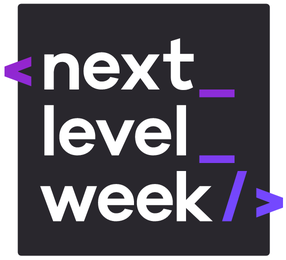

***
A Next Level Week (NLW), produzida pela a [Rocketseat](https://rocketseat.com.br/), é uma semana de desenvolvimento web. 
Durante o evento, é possível aprender novas ferramentas e tecnologias, capaz de impulsionar ao próximo nível.
As aulas proporcionadas pela a [Rocketseat](https://rocketseat.com.br/) de forma gratuita e online, ministradas pelo o [Mayk Brito](https://github.com/maykbrito), um excelente profissional.

O projeto proposto durante o evento foi um Marketplace de coleta de resíduos (Ecoleta), onde o objetivo é ajudar pessoas a encontrarem pontos de coletas de forma eficiente. Além disso, a aplicação também permite cadastrar novos pontos.

## Tecnologias

**Este projeto foi desenvolvido com as seguintes tecnologias:**

  - HTML5
  - CSS3
  - Nunjucks
  - Javascript
  - Node.Js
  - SQLite3
  
  ## Projeto
  
  ***
  
  ### Observação:
  **Dicas e sugestões serão bem vindas!** =)
  
